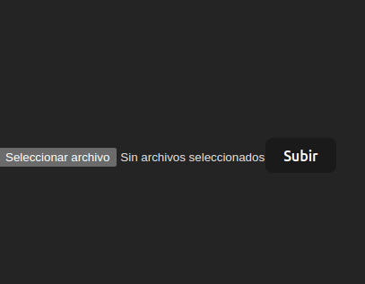
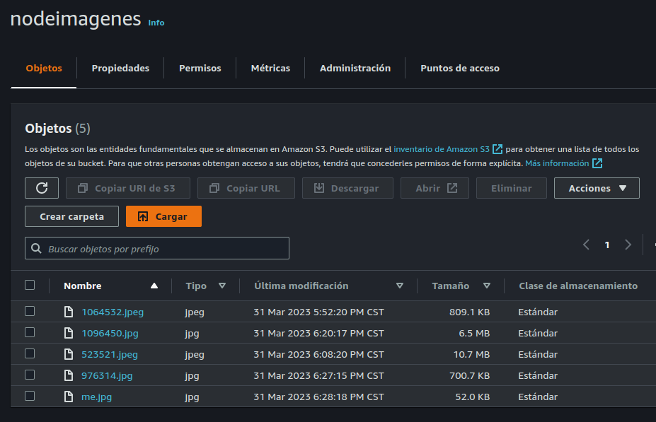

## Front end

<div align="center">



</div>

## Instrucciones

- Entra a client con el comando

```
cd client
```

- Ejecuta los siguientes comandos para instalar las dependencias:

```
npm install
```

- Ejecuta el proyecto

```
npm run dev
```
- Sube cualquier imagen que tengas disponible.

Las imagenes estaran en tu bucket de AWS S3

<div align="center">



</div>


