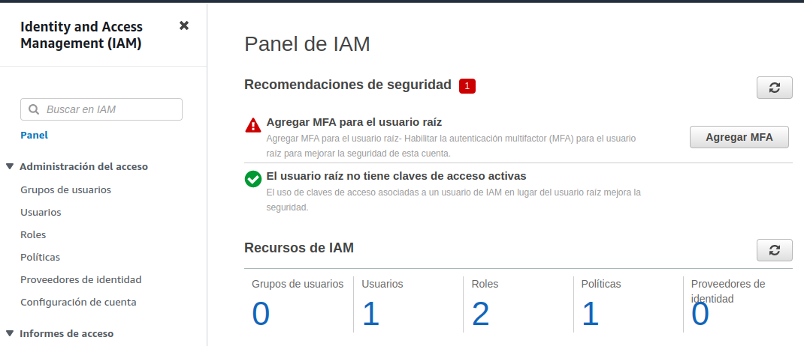
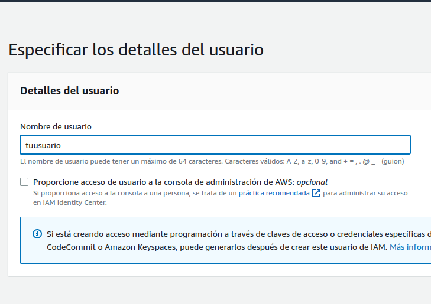
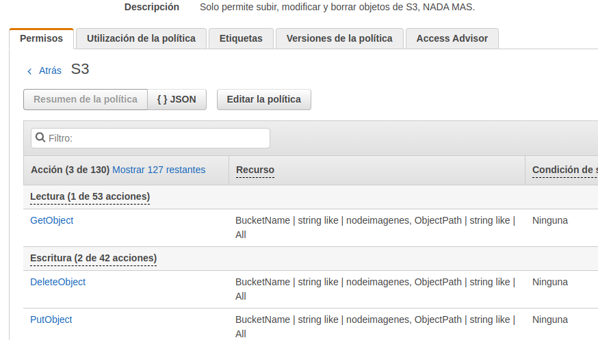
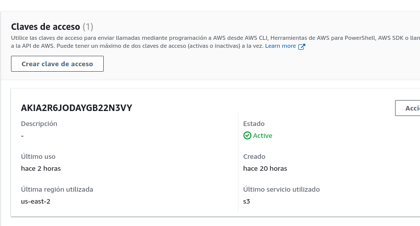
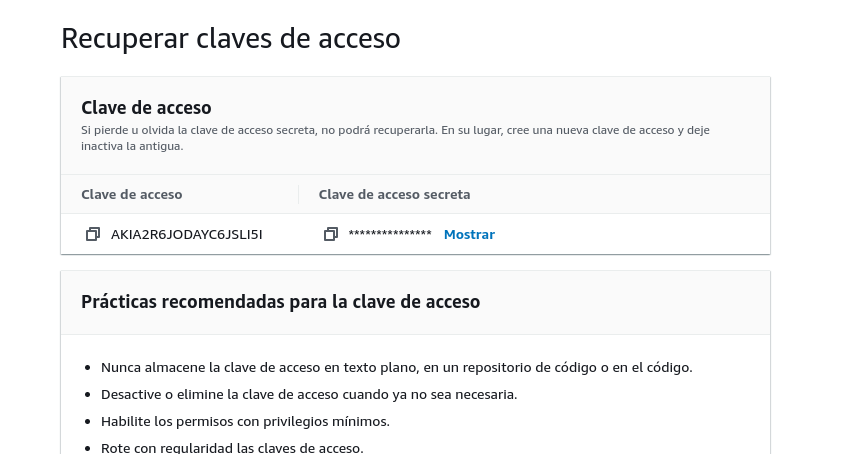

## AWS S3 SDK exemple

### Descripción
Una aplicacion completa con un Front-end y un Back-end conectados con Axios que permite subir y descargar archivos/imagenes a Amazon Web Services (AWS) con su servicio S3 usando su SDK para NodeJS.
Para este ejemplo me base en la [documentación oficial de AWS](https://docs.aws.amazon.com/sdk-for-javascript/v3/developer-guide/javascript_s3_code_examples.html).

Este proyecto utilizo las siguientes tecnologias:

## Instrucciones

En este ejemplo solo se toma como tema principal el uso de AWS S3.

Los comandos se ejecutan por separado en cada proyecto.
Revisa cada uno por separado para su configuraión.

## Asignar Credenciales de usuario IAM de AWS

Debes asignar tus credenciales de AWS primero creando un archivo que contenga las variables de entorno dentro de la carpeta "server"

- Entra a la consola de adminstracion de AWS y entra a IAM.

- Ve a usuarios y agrega uno.

- Asignale una politica que solo permite que cree, actualice y elimine objetos en S3

- Una vez creado el usuario y despues de asignarle las politicas tienes que crearle credenciales de acceso.

- Las claves de acceso publicas y privadas las copias y pegas en tus variables de entorno.

