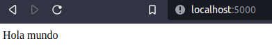
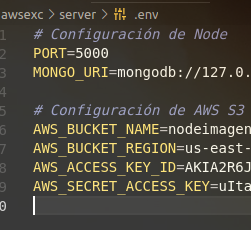
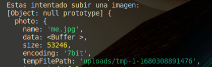
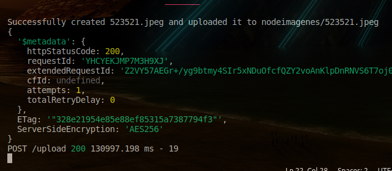
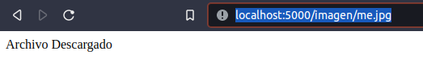
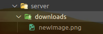

 ## Backend

<div align="center">



</div>

## Instrucciones de instalación

- Entra a server con el comando

```
cd server
```

- Ejecuta los siguientes comandos para instalar las dependencias:

```
npm install
```

- Ejecuta el proyecto

```
npm run test
```
## Variables de entorno

Crear un archivo .env en la carpeta "server" y asignale estas variables:

<div align="center">



</div>

## Uso y descarga de archivos

Cuando se esta subiendo un archivo veras esto en la consola:

<div align="center">



</div>

Cuando se complete aparecera un objeto que contiene la informacion de tu imagen y que se subio con exito a AWS s3:

<div align="center">



</div>

Para descargar imagenes debes de hacer los siguientes pasos.

- Entra a localhost:5174/imagenes/ y coloca el nombre de la imagen que quieras descargar y luego da enter.

<div align="center">



</div>

- Los nombres son completos incluyendo la extención ".jpg, .png, .jpeg"

La imagen aparecera en tus archivos de servidor:

<div align="center">



</div>
